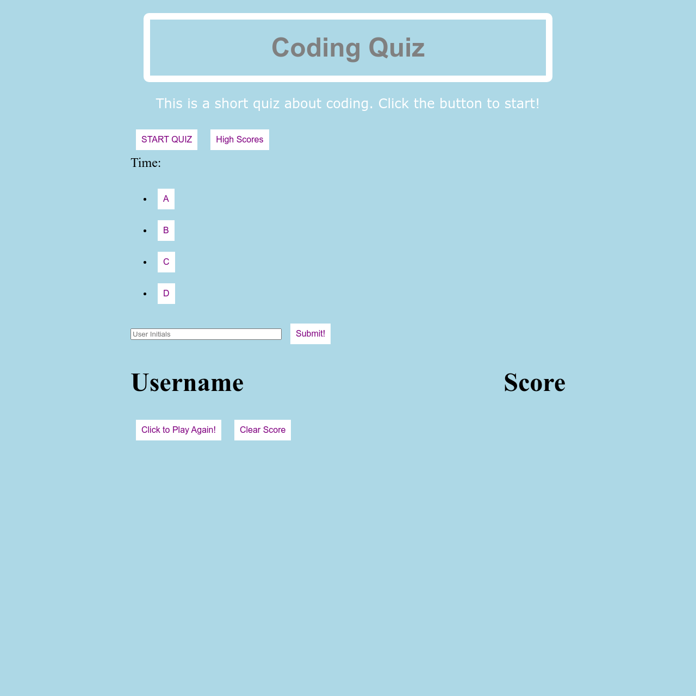

# quiz
Timed quiz

# Table of Contents
-[Purpose](#Purpose)

-[Criteria](#Criteria)

-[Notes](#Notes)

-[Credits](#Credits)

-[Screenshot](#Screenshot)

-[Website](#Link)

# Purpose
The purpose of this project is to create a "Code Quiz"

# Criteria
1. When the timer starts, the user is presented with a question.

2. When the question is answered, another question is presented.

3. When a question is answered incorrectly, time is subtracted from the timer.

4. When the questions are answered OR the timer reaches 0 the game is over.

5. When the game is over, the user can enter initials in a scoreboard. 

# Notes
This was a very challenging excersize. Javascript was definitely the hardest part of this project. The key was to put my head down and start working. The logic behind building the funcitons is starting to become clearer but can still be troublesome from time to time. It felt good to see it work correctly for the first time. I still had issues displaying content correctly. On the home page there should only be the start buttons displayed. When the game starts the user name/ score/ play again/ and clear score shouldn't be displayed. Finally when the game is over the play again/ clear score buttons shouldn't be displayed. I also should have spent more time on the CSS file but I am not very strong in Javascript so I wanted to spend most of my time on that. Overall, this was a great excersize because i learned more about Javascript.

# Credits
Ideas used from Trilogy Education services, Anthony Cooper, Youtube, and FreeCodeCamp.

# Screenshot        

# Link
https://zdeal1026.github.io/quiz/

©Copyright 2021, Zachary A. Deal